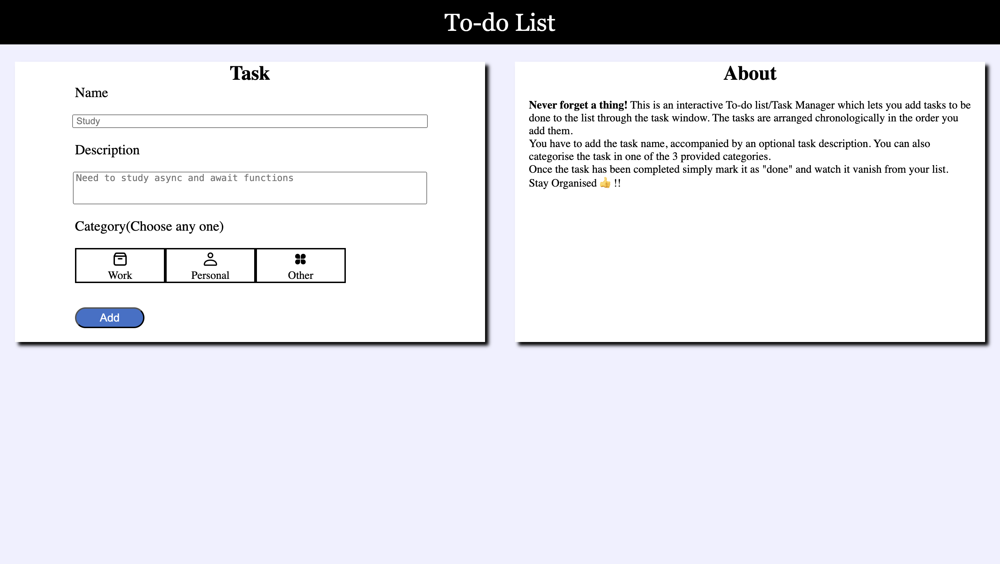
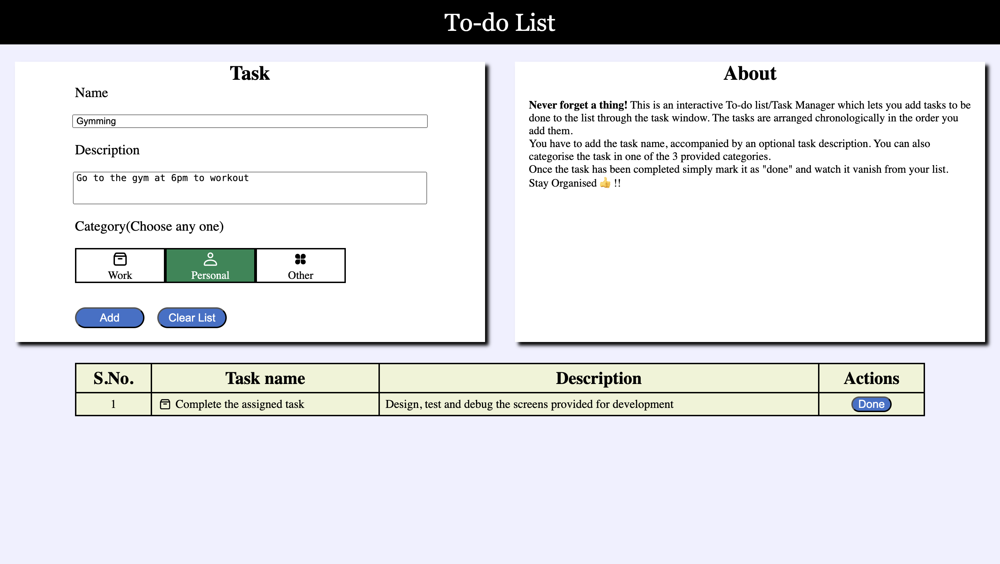
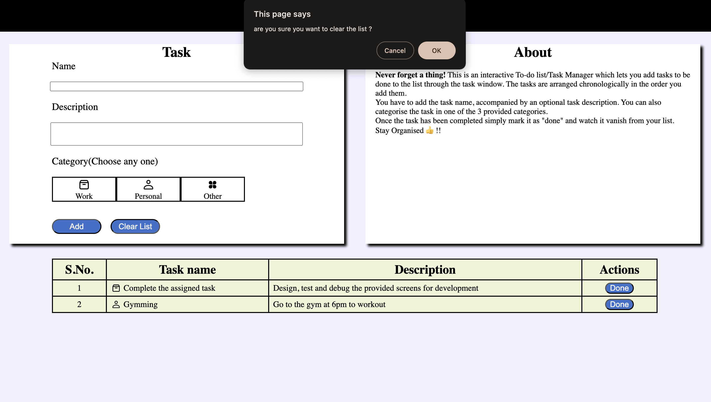
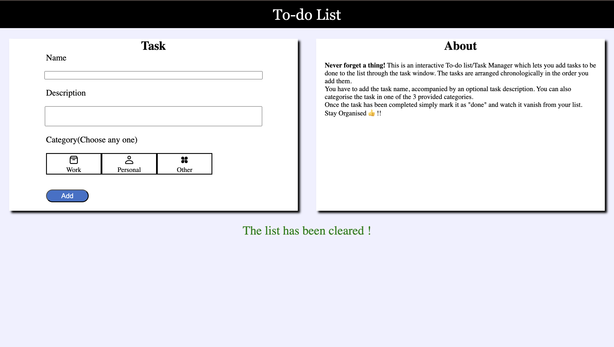
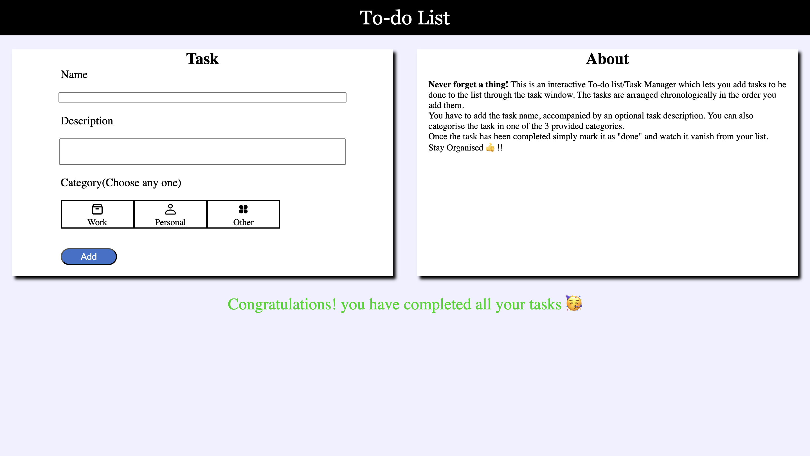

# To-do List / Task Manager

A simple web-based To-do list and Task Manager application that allows you to add tasks and manage them efficiently. The tasks are displayed chronologically based on the order you add them, and you can mark them as "done" once they are completed.

## Table of Contents

- [About](#about)
- [Features](#features)
- [Getting Started](#getting-started)
- [Usage](#usage)

## About

This is a To-do list/Task Manager web application that helps you stay organized by keeping track of tasks that need to be done. The application provides a simple and intuitive interface to add tasks with a name and description. Once a task is completed, you can mark it as "done," and it will be removed from the list.

## Features

- Add tasks with a name, description and a task category.
- Category selection through <u>custom radio buttons</u>
- When the first task is added a new table is created with serial number , task name and description, category  and actions available for the task to be done.
- Tasks are displayed in chronological order.
- Mark tasks as "done" to remove them from the list.
- <u>Automatic reduction of serial number</u> when task is completed.
- Additionally, there is a "Clear List" option that allows users to remove all tasks from the list at once. This feature provides a quick way to reset the task manager and start afresh without having to delete tasks individually.
- Simple ,interactive and user-friendly interface.
- Animations have been extensively used
- Fully responsive web design.
- <b>Element's width specific responsiveness</b> also applied using the function <u>taskNameWidthHandler</u> for <u>resize</u> event and other places where the width of the task name column changes.

## Getting Started

To run the application locally on your machine, follow these steps:

1. Clone this repository to your device.
2. Open the `index.html` file in your web browser.

Alternatively, you can also host the application on a web server of your choice.

## Usage

1. Open the application in a web browser.
2. In the "Task" section, enter the name and description of the task you want to add and select one category.
3. Click the "Add" button to add the task to your to-do list.
4. Once you complete a task, mark it as "done" to remove it from the list.

## Try it out

https://sanidhya-dobhal.github.io/To-do-List-front-end-project/

## Screenshots

### For bigger display screens like laptops and desktops

The above message is displayed when the list is cleared by using the "Clear List" button 

The above message is displayed when the tasks are marked as "done" and then the list is cleared

## Contact

Email: sanidhyadobhal2002@gmail.com 
GitHub: Sanidhya-Dobhal

Feel free to contact for reporting issues and discussing ideas
